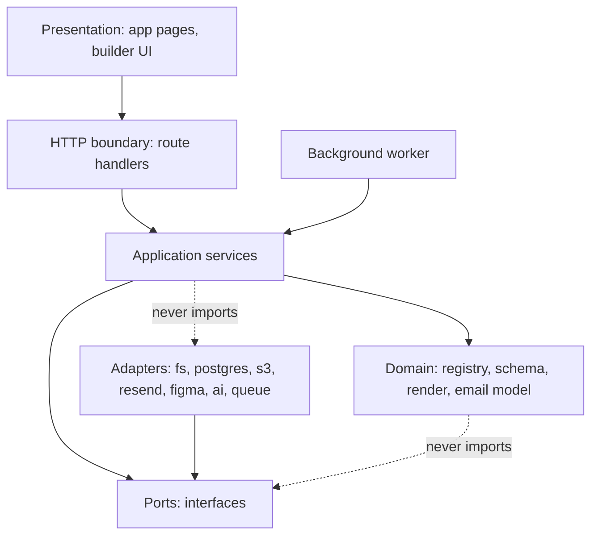
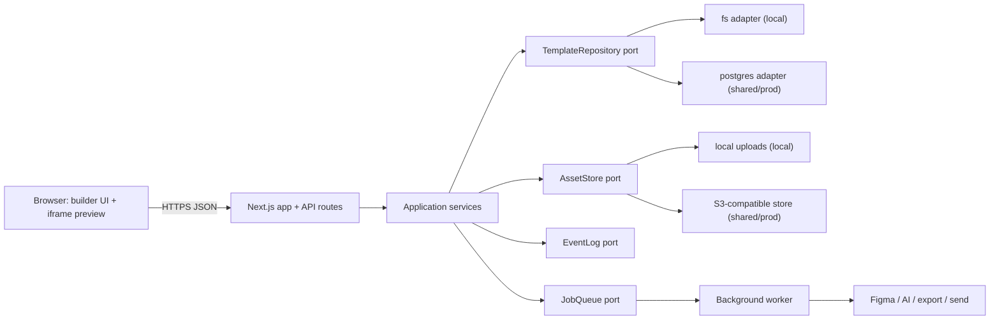
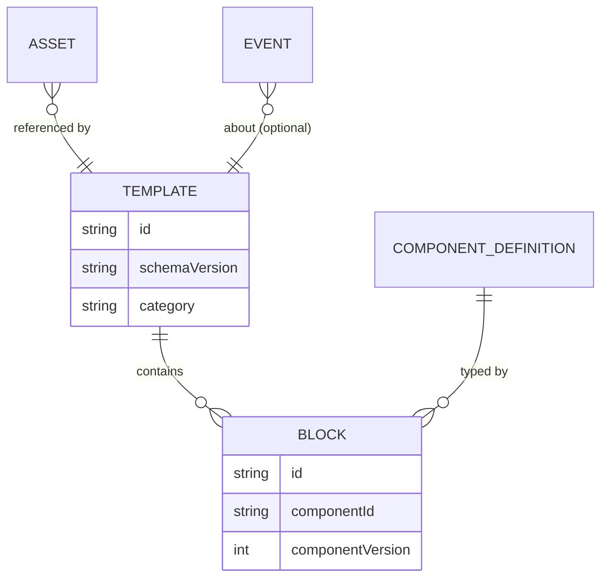

# Architecture Spine — EDM React Email Tool

## Design Paradigm

**Modular monolith** with **ports-and-adapters** at every external boundary and a **background-worker** seam for long-running work. Next.js remains the single application and HTTP boundary; domain logic lives in framework-agnostic modules under `src/lib/**`; infrastructure (storage, object store, mail, AI, Figma) is reached only through interfaces (ports) with swappable adapters.

Layer mapping:

| Layer | Home | May depend on |
| --- | --- | --- |
| Presentation (pages, builder UI) | `src/app/**` (pages), `src/builder/**` | Application |
| HTTP boundary (route handlers) | `src/app/api/**/route.ts` | Application, Domain, Ports |
| Application (use cases / services) | `src/lib/<domain>/service.ts` | Domain, Ports |
| Domain (registry, schema, render, email model) | `src/lib/registry`, `src/lib/schema`, `src/lib/render`, `src/components/email` | Domain only |
| Ports (interfaces) | `src/lib/ports/**` | Domain types only |
| Adapters (infra impls) | `src/lib/adapters/**` | Ports + external SDKs |

## Invariants & Rules

### AD-1 — Next.js is the only HTTP boundary [ADOPTED]

- **Binds:** all client → server interaction
- **Prevents:** ad-hoc servers or the browser calling infrastructure (fs, SDKs, mail, AI) directly
- **Rule:** every server capability is reached through a `src/app/api/**/route.ts` handler. Route handlers contain no business logic — they validate input, call an application service, and shape the response.

### AD-2 — Persistence is reached only through ports

- **Binds:** template read/write, asset storage, event logging
- **Prevents:** two call sites diverging on `fs` vs database vs object-store access
- **Rule:** domain and application code depend on `TemplateRepository`, `AssetStore`, and `EventLog` interfaces in `src/lib/ports/`. Direct `fs`, database-client, or S3-SDK calls outside `src/lib/adapters/` are prohibited.

### AD-3 — Deployment mode selects adapters at composition root, not at call sites

- **Binds:** local vs shared/production behavior
- **Prevents:** environment `if` branches leaking through the codebase
- **Rule:** a single composition root (`src/lib/container.ts`) reads `STORAGE_DRIVER` (`filesystem` | `postgres`) and `ASSET_DRIVER` (`local` | `s3`) and binds concrete adapters once. Everything else consumes injected ports. Local mode MAY use `filesystem`/`local`; shared and production MUST use `postgres`/`s3`.

### AD-4 — The template document schema is the single source of truth for persisted shape

- **Binds:** every persistence adapter, API payload, and migration
- **Prevents:** the Postgres row shape and the JSON file shape drifting apart
- **Rule:** all adapters serialize to and validate against `emailTemplateDocumentSchema` (`src/lib/schema/validators.ts`). Any stored shape change bumps `SCHEMA_VERSION` and ships a forward migration; adapters never persist an unvalidated document.

### AD-5 — The component registry is the single source of truth for blocks

- **Binds:** builder palette, property panel, render pipeline, AI catalog
- **Prevents:** a block that renders differently than it edits, or exists in one surface but not another
- **Rule:** a block is defined once in `src/lib/registry/definitions.ts` (component + defaultProps + fields + version). Palette, `PropertyPanel`, `DynamicEmailTemplate`, and the AI catalog derive from the registry; none hard-code a block list. Legacy `src/emails/*` static templates are demo-only and MUST NOT be a second registry.

### AD-6 — All HTML rendering happens server-side through one renderer

- **Binds:** preview, export, and send
- **Prevents:** preview HTML diverging from exported/sent HTML
- **Rule:** every output path renders through `DynamicEmailTemplate` via `@react-email/render` on the server. `editable` mode adds selection wrappers/bridge; export and send MUST render with `editable` omitted. No client-side email HTML generation.

### AD-7 — Long-running work crosses the worker boundary through a job port

- **Binds:** export, Figma import/build, AI analysis
- **Prevents:** request-scoped handlers blocking, timing out, or holding connections during multi-second work
- **Rule:** operations that can exceed a fast request budget are enqueued through a `JobQueue` port and executed by the worker runtime; the API returns a job handle and status is polled or streamed. Local mode MAY use an in-process adapter; shared/production MUST use a durable queue adapter. Pure, fast render (preview) stays synchronous.

### AD-8 — Every protected API route validates input with Zod before acting

- **Binds:** all state-changing and external-calling routes
- **Prevents:** unvalidated payloads reaching services, storage, or third-party SDKs
- **Rule:** each handler parses its body/params with a schema from `src/lib/schema/validators.ts` (or a route-local schema) and returns `400` on failure before any side effect. Validation runs after auth/authz once those exist (see AD-10).

### AD-9 — Errors cross the HTTP boundary as a single typed envelope

- **Binds:** every API response and the client fetch layer
- **Prevents:** each route inventing its own error shape; leaking internals to the browser
- **Rule:** failures return `{ error: { code, message } }` with an appropriate status. Messages are safe for display; stack traces, provider identifiers, secrets, and env values never appear in responses or client-visible logs. Server logs carry the detail, keyed by a correlation id.

### AD-10 — Authorization is a server-side gate the whole API funnels through (deferred implementation, reserved seam)

- **Binds:** all non-public routes and pages
- **Prevents:** access control implemented as hidden UI, or checks scattered per-route and missed on one
- **Rule:** a single server-side access-decision point (middleware + a `requireAccess()` helper) wraps protected routes and pages. Until authentication is implemented, this gate runs in an explicit `AUTH_MODE=open` local posture; **external/shared exposure MUST set `AUTH_MODE=enforced` and is blocked until an identity adapter is wired.** UI visibility is never the enforcement mechanism.

### AD-11 — Secrets and infrastructure credentials are server-only

- **Binds:** Figma, AI (Gemini/Ollama), Resend, database, object store
- **Prevents:** credentials shipping in the client bundle or appearing in responses/logs
- **Rule:** credentials are read from server environment inside adapters only. No secret is imported into `src/builder/**`, `src/components/**`, or any `'use client'` module, and none is echoed in an API response.

Dependency direction (a rule, not a picture):



## Consistency Conventions

| Concern | Convention |
| --- | --- |
| Naming — components | `PascalCase.tsx`, `React.FC<Props>` for email blocks; named function exports for builder UI |
| Naming — modules | `camelCase.ts`; one domain per folder under `src/lib/<domain>` |
| Naming — ports/adapters | Port = capability noun (`TemplateRepository`); adapter = `<driver><Capability>` (`PostgresTemplateRepository`, `S3AssetStore`) |
| Naming — API routes | kebab-case folders + `route.ts`; component/template IDs kebab-case |
| Imports | `@/*` alias only; no cross-package relative imports |
| Ids | `generateId()` for entities; UUID for stored asset object keys |
| Dates | ISO 8601 strings (`createdAt`/`updatedAt`) at every boundary |
| Error shape | `{ error: { code, message } }`; statuses 400/401/403/404/409/500 |
| State mutation (client) | Only through `useBuilderStore` actions; immutable updates; no direct store mutation from components |
| Validation | Zod at the HTTP boundary and inside every persistence adapter |
| Config | Read only in the composition root and adapters; typed and validated once at startup |
| Logging | Structured, correlation-id keyed; minimum personal data; never secrets |

## Stack

| Name | Version |
| --- | --- |
| Next.js | 14.2 (current pin; 16.2.x is latest stable — upgrade tracked as Deferred) |
| React | 18.2 |
| TypeScript | 5.3 |
| @react-email/components | 1.0.12 |
| @react-email/render | 1.4.0 |
| Zustand | 5.0 |
| Zod | 3.23 |
| @dnd-kit | 6.x/10.x |
| sharp | 0.33 |
| jszip | 3.10 |
| resend | 6.x |
| PostgreSQL (shared/prod persistence) | 17.x (16.x acceptable; avoid 14 — EOL 2026-11-12) |
| Object storage (shared/prod assets) | S3-compatible (AWS S3 or MinIO for self-host) |
| Job/queue runtime (shared/prod) | Durable queue adapter — TBD (Deferred) |

## Structural Seed

Container view:



Source tree (target — additions marked, existing kept):

```text
src/
  app/
    api/**/route.ts        # thin handlers only (existing routes kept)
    middleware.ts          # NEW: access gate (AD-10), correlation id
  builder/                 # client builder UI + Zustand store (existing)
  components/email/         # registry-backed blocks (existing, canonical)
  emails/                  # legacy static demos (existing, demo-only)
  lib/
    container.ts           # NEW: composition root, binds adapters (AD-3)
    config.ts              # NEW: typed env validation
    ports/                 # NEW: TemplateRepository, AssetStore, EventLog, JobQueue, Mailer, AiProvider, FigmaClient
    adapters/              # NEW: filesystem/, postgres/, local-assets/, s3/, resend/, figma/, ai/, queue/
    registry/              # block registry (existing, canonical — AD-5)
    schema/                # template types + Zod + migrations (existing + NEW migrations/)
    render/                # DynamicEmailTemplate (existing — AD-6)
    email/                 # responsive CSS utils (existing)
    export/                # export pipeline (existing → moves behind JobQueue)
    figma/  ai/            # import/analysis logic (existing → behind ports + JobQueue)
    templates/             # service.ts wraps repository (existing fileStorage becomes an adapter)
  worker/                  # NEW: worker entry consuming JobQueue (shared/prod)
db/
  migrations/              # NEW: SQL migrations for postgres driver
```

Core entities (names + relationships; attributes that are invariants live in AD-4):



## Capability → Architecture Map

| Capability / Area | Lives in | Governed by |
| --- | --- | --- |
| Build/edit template | `src/builder/**`, `useBuilderStore` | AD-5, client state convention |
| Persist template | `src/lib/templates/service.ts` → `TemplateRepository` | AD-2, AD-3, AD-4 |
| Registry metadata | `src/lib/registry`, `/api/registry` | AD-5 |
| Preview render | `/api/email/render` → `DynamicEmailTemplate` | AD-1, AD-6 |
| Export | `/api/email/export` → `JobQueue` → export pipeline | AD-6, AD-7 |
| Test send | `/api/email/send` → `Mailer` adapter | AD-1, AD-6, AD-11 |
| Asset upload | `/api/assets/upload` → `AssetStore` | AD-2, AD-3, AD-8 |
| Figma import/build | `/api/figma/*` → `JobQueue` → Figma/AI | AD-7, AD-11 |
| AI analysis | `/api/ai/*` → `AiProvider` adapter | AD-7, AD-11 |
| Access control | `middleware.ts` + `requireAccess()` | AD-10 |
| Errors | all routes + client fetch | AD-9 |

## Deferred

- **Authentication/identity adapter** — deferred per direction; the AD-10 seam is reserved. External exposure blocked until wired.
- **Durable queue technology** choice (e.g. pg-boss on Postgres vs Redis/BullMQ vs SQS) — decide when shared deployment is scheduled; the `JobQueue` port makes it swappable.
- **Next.js 14 → 16 upgrade** — track as maintenance; 16.2.x is current stable and carries security fixes.
- **Per-template ownership / multi-tenant isolation** — out of scope until auth exists; schema leaves room via an owner field at that time.
- **Asset delivery policy** (public CDN vs signed URLs vs always-bundled) — product decision open in PRD; `AssetStore` port abstracts it.
- **Observability stack** (metrics/tracing backend) — beyond correlation-id logging; decide at shared-deployment time.
- **Test/lint/format tooling baseline** — no suite exists today; establish alongside adapter work.
