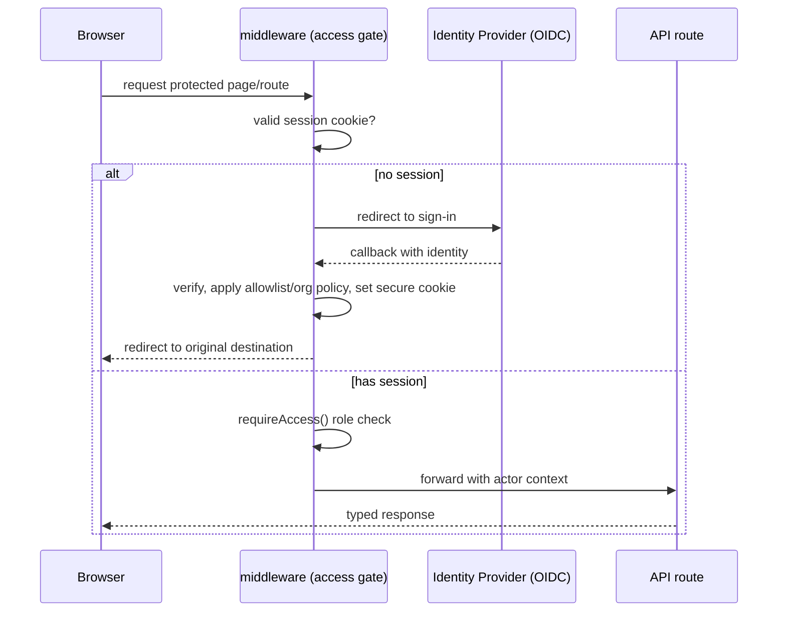

# Solution Design — EDM React Email Tool

This is the implementation-facing companion to `ARCHITECTURE-SPINE.md`. It explains the eight areas requested by the architect brief. It describes structure and contracts; it does not include implementation code.

Authentication is **deferred** per the current direction. It is designed here as a reserved seam (AD-10) so that no external deployment happens without it, and so that adding it later requires no rework of the routes.

The guiding move is: **wrap the existing working code behind interfaces first, then swap implementations by deployment mode.** Nothing in the current builder behavior changes for a local developer.

---

## 1. Folder changes

Additions are additive; existing folders keep their responsibilities. Legacy `src/emails/*` stays as demo-only (per AD-5).

| Path | Status | Purpose |
| --- | --- | --- |
| `src/lib/ports/` | new | Interfaces: `TemplateRepository`, `AssetStore`, `EventLog`, `JobQueue`, `Mailer`, `AiProvider`, `FigmaClient` |
| `src/lib/adapters/filesystem/` | new | Current `fileStorage.ts` logic, refactored to implement `TemplateRepository` |
| `src/lib/adapters/postgres/` | new | Postgres implementation of `TemplateRepository` + `EventLog` |
| `src/lib/adapters/local-assets/` | new | Local `public/images/uploads` implementation of `AssetStore` |
| `src/lib/adapters/s3/` | new | S3-compatible implementation of `AssetStore` |
| `src/lib/adapters/resend/` | new | `Mailer` implementation wrapping Resend |
| `src/lib/adapters/ai/` | new | `AiProvider` wrapping existing Gemini/Ollama code |
| `src/lib/adapters/figma/` | new | `FigmaClient` wrapping existing Figma code |
| `src/lib/adapters/queue/` | new | In-process (local) and durable (shared) `JobQueue` implementations |
| `src/lib/container.ts` | new | Composition root: reads env, binds one adapter per port (AD-3) |
| `src/lib/config.ts` | new | Typed, validated environment config |
| `src/lib/templates/service.ts` | new | Application service over `TemplateRepository` (routes call this, not the adapter) |
| `src/app/middleware.ts` | new | Access gate + correlation id (AD-9, AD-10) |
| `src/worker/` | new | Worker entry point consuming `JobQueue` (shared/prod) |
| `db/migrations/` | new | SQL migrations for the Postgres driver |
| `src/lib/schema/migrations/` | new | Document `schemaVersion` forward migrations (AD-4) |
| `src/lib/templates/fileStorage.ts` | refactor | Becomes the filesystem adapter internals; public callers move to `service.ts` |
| `src/app/api/**/route.ts` | refactor | Slimmed to validate → call service → shape response (AD-1) |

No change required to: `src/components/email/**`, `src/lib/registry/**`, `src/lib/render/**`, `src/builder/**` component tree (store gains one small behavior, see §7).

---

## 2. Components (logical building blocks)

Grouped by architectural layer. "Component" here means a module/unit, not only a React component.

**HTTP boundary** — `src/app/api/**/route.ts`, `middleware.ts`. Thin: parse input, call a service, return the typed envelope. No `fs`/SDK access here.

**Application services** — one per domain area:
- `TemplateService` — CRUD, duplicate, list (wraps `TemplateRepository`, stamps timestamps/user metadata).
- `RenderService` — builds the React Email tree via `DynamicEmailTemplate` and renders to HTML (synchronous, fast).
- `ExportService` — enhances HTML, bundles images, zips; runs via `JobQueue`.
- `SendService` — renders clean HTML and hands to `Mailer`.
- `AssetService` — validates and stores uploads via `AssetStore`.
- `ImportService` (Figma/AI) — orchestrates fetch/parse/build via `FigmaClient`/`AiProvider`, runs via `JobQueue`.

**Domain (unchanged, canonical)** — registry (`definitions.ts`), schema (`template.ts` + validators), renderer (`DynamicEmailTemplate`), email blocks, responsive utilities.

**Ports** — interfaces the services depend on (see §4/§3).

**Adapters** — concrete infra behind each port, selected at the composition root.

**Composition root** — `container.ts` wires exactly one adapter per port based on `STORAGE_DRIVER`/`ASSET_DRIVER`/queue mode.

**Worker** — `src/worker/` executes queued jobs using the same services and ports.

**Client** — builder UI + `useBuilderStore` (§7), unchanged except session-aware fetch handling reserved for when auth lands.

---

## 3. APIs

Existing routes are preserved; contracts are standardized (envelope from AD-9, validation from AD-8). Long-running routes gain an async job contract (AD-7).

| Method | Route | Service | Sync/Async |
| --- | --- | --- | --- |
| GET/POST | `/api/templates` | TemplateService | sync |
| GET/PUT/DELETE | `/api/templates/[id]` | TemplateService | sync |
| POST | `/api/templates/[id]/duplicate` | TemplateService | sync |
| GET | `/api/registry` | registry | sync |
| POST | `/api/email/render` | RenderService | sync (fast) |
| POST | `/api/email/export` | ExportService | **async (job)** |
| POST | `/api/email/send` | SendService | sync or async |
| GET | `/api/email/[template]` | legacy static | sync (demo-only) |
| POST | `/api/assets/upload` | AssetService | sync |
| POST | `/api/figma/*` | ImportService | **async (job)** |
| POST | `/api/ai/*` | ImportService | **async (job)** |
| GET | `/api/jobs/[id]` | JobQueue | sync (new) |

**Async job contract:** long-running POSTs return `202` with `{ jobId }`; the client polls `GET /api/jobs/[id]` → `{ status: 'queued'|'running'|'done'|'error', result?, error? }`. Local mode runs the in-process adapter so behavior is identical without extra infrastructure.

**Success envelope:** endpoints return their existing payloads (e.g. `{ html }`, `{ templates }`) on `200`/`201`.

**Error envelope (AD-9):** `{ error: { code, message } }` with status `400` (validation), `401` (unauthenticated, once enforced), `403` (forbidden), `404`, `409` (write conflict, §4), `500`.

---

## 4. Database changes

Persistence is behind `TemplateRepository`/`EventLog` (AD-2), selected by `STORAGE_DRIVER` (AD-3). Local developers may keep filesystem JSON; shared/production use Postgres.

**Why a database for shared mode:** the current `fs`-based store (`src/lib/templates/fileStorage.ts`) cannot safely support concurrent writers or multiple app instances, and silently skips invalid files. It is fine for a single local user only.

**Postgres schema (initial):**

- `templates`
  - `id` (uuid, pk), `schema_version` (text), `name`, `description`, `category`, `tags` (text[]), `meta` (jsonb), `document` (jsonb — the full validated `EmailTemplateDocument`), `duplicated_from` (uuid, nullable), `created_at`, `updated_at`, `updated_by` (nullable until auth), `revision` (int).
  - `document` is the source of truth; top-level columns are projections for listing/filtering.
- `assets`
  - `id` (uuid), `object_key`, `content_type`, `byte_size`, `checksum`, `created_at`, `created_by` (nullable).
- `events` (backs `EventLog`)
  - `id`, `type`, `actor` (nullable until auth), `target_id` (nullable), `timestamp`, `correlation_id`, `data` (jsonb, no secrets/PII beyond minimum).

**Invariants:**
- Every write validates against `emailTemplateDocumentSchema` before persisting (AD-4). The JSON adapter and the Postgres `document` column store the exact same validated shape.
- Concurrent edits use the `revision` column for optimistic concurrency; a stale write returns `409` instead of silently overwriting (closes a current gap).
- Schema shape changes bump `SCHEMA_VERSION` and ship a migration in `src/lib/schema/migrations/`; `db/migrations/` holds SQL DDL.

**Migration path:** a one-time script reads existing `data/templates/*.json`, validates, and inserts into `templates` — reusing the same schema, so no data reshaping.

---

## 5. Authentication flow (deferred — reserved seam)

Not implemented now. Designed so it drops into AD-10 without touching route logic.

**Current posture:** `AUTH_MODE=open` for local developer use. The access gate exists but allows all requests and stamps an anonymous actor. **`AUTH_MODE=enforced` is required for any shared/external deployment and is the release gate** — the app refuses to serve protected routes externally while identity is unwired.

**Target flow when enabled (OIDC, provider TBD):**

- Sessions: secure, HTTP-only, same-site cookies (NFR-1).
- Roles: `Member` / `Administrator`, enforced server-side (never UI-only).
- API returns `401` unauthenticated, `403` unauthorized, using the AD-9 envelope.
- `updated_by`/`actor`/`created_by` columns are populated once identity exists; they are nullable until then so the schema is ready in advance.

---

## 6. Security considerations

Mapped to PRD NFRs and current gaps.

- **Boundary discipline (AD-1):** browser never touches `fs`, DB, mail, AI, or Figma directly — only via routes.
- **Secrets server-only (AD-11):** Figma/AI/Resend/DB/object-store credentials live in adapters, read from env, never in client bundles, responses, or logs.
- **Input validation (AD-8):** Zod on every state-changing/external-calling route before side effects.
- **Safe errors (AD-9):** no stack traces, provider names, or env values cross to the browser; correlation id links a client-visible failure to server detail.
- **Upload hardening:** `AssetService` enforces content-type allowlist, size limits, and UUID object keys (prevents path traversal — an AWS-documented presigned/upload risk).
- **Asset delivery policy (open):** choose public-CDN vs signed URLs vs always-bundled before external launch; recipients of sent emails cannot authenticate, so hosted images must remain reachable by them (PRD FR-7.3).
- **CSRF:** state-changing browser requests protected once cookie-based auth exists (PRD FR-4.5).
- **Transport:** HTTPS in shared/production (NFR-3).
- **Fail closed (NFR-9):** when session validity cannot be established in enforced mode, protected content/actions are unavailable.
- **External-exposure gate:** deployment tooling must assert `AUTH_MODE=enforced` + an identity adapter before any non-local bind; internal use must stay on localhost/VPN.
- **Dependency hygiene:** track the Next.js 14→16 upgrade (16.2.x carries security fixes) and Postgres version (avoid 14, EOL 2026-11-12).

---

## 7. State management

**Server state** is authoritative and lives in Postgres/filesystem behind ports. **Client state** is editing state only.

- `useBuilderStore` (Zustand) remains the single client store: current template, registry cache, selection, dirty/saving flags, Figma session, view mode. Components mutate only through store actions with immutable updates (existing convention, now an invariant).
- Persistence stays server-authoritative: the store saves via `TemplateService` (PUT) and reloads on open; the store is never the source of truth for saved data.
- **New:** optimistic-concurrency awareness — a save carries the last known `revision`; on `409` the store surfaces a conflict state instead of reporting a false success (fixes a silent-overwrite risk and satisfies "no false save success").
- **Reserved for auth:** the client fetch layer centralizes handling so a `401` in enforced mode stops protected follow-up actions and prompts re-auth (PRD FR-5.4) — a no-op while `AUTH_MODE=open`.
- Async jobs (export/import) add lightweight client status (`jobId` → poll) rather than blocking the UI.

---

## 8. Route protection

Two layers, both server-side (AD-10); UI hiding is never the control.

1. **Edge/middleware layer** (`src/app/middleware.ts`): matches protected page and API paths, checks session in enforced mode, redirects pages / returns `401` for APIs, and attaches a correlation id to every request. Public matchers: sign-in, auth callback, access-denied, health.

2. **Handler layer** (`requireAccess(role)`): each protected route/service call asserts the role before acting; Administrator-only operations reject `Member` with `403` and make no state change. This guarantees protection even if a route is added and the matcher is missed.

**Now vs later:**
- **Now (`AUTH_MODE=open`):** middleware passes through, stamps an anonymous actor, still adds correlation ids and the error envelope. Internal-network/localhost only.
- **Later (`AUTH_MODE=enforced`):** same matchers begin enforcing sessions and roles with zero route rewrites — only the identity adapter and mode flag change.

Protected matchers cover: `/builder/**` and all `/api/**` except explicitly public endpoints. Legacy `/preview/[template]` and `/api/email/[template]` are demo-only and must be disabled or protected before external exposure.

---

## Build order (maps to the phased roadmap)

1. Introduce ports + `container.ts` + `config.ts`; refactor `fileStorage.ts` into the filesystem adapter and add `TemplateService`. No behavior change.
2. Standardize routes on the Zod-validate → service → envelope shape; add correlation ids and the pass-through access gate.
3. Add Postgres adapter + migrations + the JSON→DB import script; enable via `STORAGE_DRIVER`.
4. Add S3 asset adapter + upload hardening + asset-delivery policy.
5. Extract export and Figma/AI import behind `JobQueue` + `/api/jobs/[id]` + worker runtime; add optimistic concurrency.
6. Implement the AD-10 identity adapter and flip `AUTH_MODE=enforced` — the release gate for any external deployment.

Steps 1–2 are safe for the current local team immediately; 3–5 unlock shared deployment; 6 unlocks external use.
