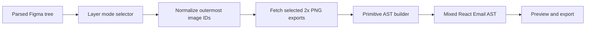

# Architecture Spine — Per-node Figma Flatten Selection

## Design Paradigm

Figma import is a compiler pipeline. A render-mode override is a source-level lowering directive: it is selected against the parsed Figma tree, normalized before asset fetching, and consumed once while generating the React Email AST.



## Invariants & Rules

### AD-1 — Source identity and generated identity do not mix

- **Binds:** import session, layer selector, build request
- **Prevents:** treating a generated dotted AST path as a Figma export ID
- **Rule:** Pre-build render choices are keyed only by stable Figma `nodeId`. Generated AST selection continues to use dotted paths after build.

### AD-2 — Image overrides are atomic outermost subtrees

- **Binds:** `resolveForceImageIds`, Figma image export, primitive mapper
- **Prevents:** duplicate parent/child exports and partially duplicated content
- **Rule:** `resolveForceImageIds` unions manual, hint, AI, and enabled auto IDs, then normalizes the combined set against the desktop source tree to visible, known, non-root, outermost nodes in source order. Each surviving node fetches one 2× PNG and emits one `Img`; traversal must not recurse into its children.

### AD-3 — Explicit user choice outranks registry inference

- **Binds:** `FigmaBuildModal`, `FigmaBatchModal`, `/api/figma/build-email`, `/api/figma/import-build`, `buildFigmaDesign`
- **Prevents:** a registry mapping silently discarding the user's Image selections
- **Rule:** Every build request may carry `forcePrimitiveBuild`. The modal sets it true while at least one layer differs from the current auto-detect baseline, an AI suggestion is accepted, or a non-empty image instruction is submitted. `true` skips registry mapping; `false` with only auto-detected IDs retains existing registry-link precedence.

### AD-4 — Every source layer is discoverable

- **Binds:** source outline model and import modal
- **Prevents:** only auto-detected icons being selectable while text leaves or composite banners remain hidden
- **Rule:** In Design mode the selector lists at most 400 visible non-root source nodes with name, type, dimensions, source ID, hierarchy depth, and text preview. Enabled auto-detected icons begin checked and marked `auto`; unchecked IDs are not re-added server-side because the modal submits the complete checked set with `autoDetectImages=false`. Checked means Image; unchecked means Design. Whole-component Image mode is a separate path and does not show this selector.

### AD-5 — Flattening is materialized, not deferred

- **Binds:** generated block persistence and email export
- **Prevents:** exported emails depending on Figma credentials, source documents, or editor metadata
- **Rule:** The build stores a normal `Img` node with a local `/images/uploads/` URL at the existing 2× export scale and 1× layout width. For an explicit build, any selected node lacking a PNG fails the build with its source IDs; the mapper never falls back to partial children. Persisted blocks and export HTML require neither source-tree state nor render-mode override metadata.

### AD-6 — Per-node choices target the desktop source tree

- **Binds:** paired desktop/mobile imports, primitive mapper, responsive image merge
- **Prevents:** applying unrelated desktop node IDs to a separately authored mobile tree
- **Rule:** The selector and `imageNodeIds` address the desktop tree only. A forced desktop subtree uses the same generated PNG at both viewport sizes; no mobile `nodeId` or name/path match may replace it until explicit paired-node mapping exists.

## Consistency Conventions

| Concern | Convention |
| --- | --- |
| Source identifiers | Figma colon-form node IDs, e.g. `284:1387` |
| UI labels | `Design` = structured AST; `Image` = one flattened 2× PNG |
| Selection payload | Existing `imageNodeIds`; `forcePrimitiveBuild` records explicit authority |
| Conflict handling | Parent Image selection suppresses selected descendants |
| Failure behavior | Missing explicit exports fail at the build boundary with node IDs; no partial child design is emitted |
| Existing boundaries | Figma credentials remain server-only; generated assets use the existing `public/images/uploads` adapter |

## Stack

| Name | Version |
| --- | --- |
| Next.js | 14.2 |
| React | 18.2 |
| @react-email/components | 1.0.12 |
| @react-email/render | 1.4.0 |
| react-email CLI | 6.5.0 |
| Zod | 3.23.8 |
| Vitest | 4.1.10 |

## Structural Seed

```text
src/lib/figma/detectImageNodes.ts      # source outline and hierarchy metadata
src/lib/figma/resolveForceImageIds.ts  # normalize effective image directives
src/lib/figma/attachMissingForcedExports.ts
                                       # fetch selected 2x PNGs into uploads
src/lib/figma/buildFigmaDesign.ts      # registry-versus-primitives authority
src/lib/figma/figmaPrimitives.ts       # atomic selected-subtree lowering
src/builder/components/FigmaBuildModal.tsx
                                       # source-node Design/Image selector
src/app/api/figma/build-email/route.ts # fetched-session build contract
src/app/api/figma/import-build/route.ts
                                       # single-shot build contract
```

## Capability → Architecture Map

| Capability | Lives in | Governed by |
| --- | --- | --- |
| Browse source layers | outline model + Figma build modal | AD-1, AD-4 |
| Select composite banner as image | modal state + request payload | AD-3, AD-4 |
| Export exact subtree PNG | forced export attachment | AD-2 |
| Produce mixed semantic/raster email | primitive mapper | AD-2, AD-5 |
| Keep final email independent of Figma | generated AST and upload asset | AD-5 |

## Deferred

- Mapping one desktop source-node choice to a separately authored mobile Figma node; current same-PNG behavior is fixed by AD-6 and should be revisited when paired-frame node correspondence is defined.
- Changing an already-built AST subtree back to source design or re-rasterizing it; revisit with a source-backed re-import model.
- Persisting import presets across unrelated import sessions.
- Deployment and operations changes: none; this feature reuses the existing Figma API and local upload storage.
