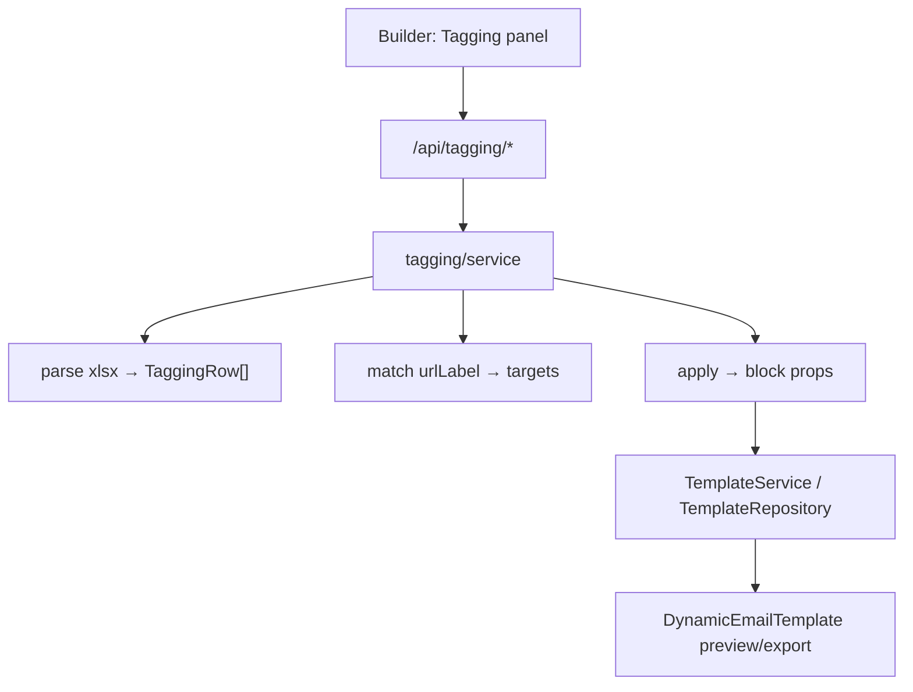
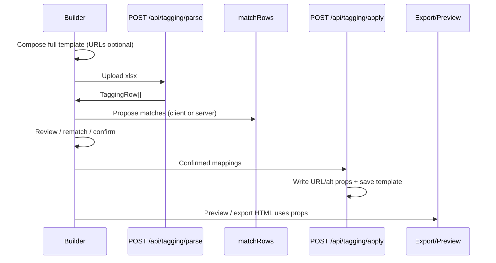

# Architecture Spine — Tagging URL import

## Design Paradigm

Same **modular monolith / ports-and-adapters** as the parent initiative. This feature adds a **tagging** application slice: parse Excel → normalize rows → match to linkable targets → apply into existing block props → checklist UI. No new persistence driver. Template save still goes through `TemplateRepository`.

| Layer | Home | May depend on |
| --- | --- | --- |
| Builder UI (upload, map review, checklist) | `src/builder/**` | HTTP APIs only |
| HTTP | `src/app/api/tagging/**/route.ts` | Tagging service, Zod |
| Application | `src/lib/tagging/service.ts` | Domain tagging + template service / ports |
| Domain | `src/lib/tagging/{parse,match,apply,types}.ts` + registry field defs | Domain only |
| Infra | `exceljs` inside parse adapter/helper used by domain/service on server | — |

## Inherited Invariants

| Inherited | From parent | Binds here |
| --- | --- | --- |
| AD-1 | initiative spine | Tagging upload/parse/apply only via Next.js API routes |
| AD-2 / AD-3 / AD-4 | initiative spine | Applied props persist on template document through existing repository + schema |
| AD-5 | initiative spine | Linkable targets discovered from registry field defs (`type: 'url'` + alt siblings) |
| AD-6 | initiative spine | Preview/export HTML comes from block props via `DynamicEmailTemplate` — no parallel URL HTML rewrite |
| AD-8 / AD-9 | initiative spine | Zod on tagging routes; uniform error envelope |
| AD-10 / AD-11 | initiative spine | Open auth posture; secrets/server-only excel parse |

## Invariants & Rules

### AD-12 — Tagging is post-compose only [ADOPTED]

- **Binds:** CAP-1, builder assemble flow
- **Prevents:** requiring FINAL URLs while dragging/building/Figma-importing components
- **Rule:** Excel upload + map UI are available on an open composed template. Component assembly MUST allow empty/placeholder URL props. Tagging MUST NOT be a gate on adding blocks.

### AD-13 — Canonical tagging row model [ADOPTED]

- **Binds:** CAP-1, parse, sheet contract
- **Prevents:** route handlers and UI inventing divergent column interpretations
- **Rule:** Every imported data row normalizes to `TaggingRow`: `{ finalUrl, urlLabel, altText, raw }`. Map Book1 (and equivalent) headers **FINAL URL**, **URL Label**, **Alt Text** (tolerant of whitespace/newlines in header cells). Rows without a usable `finalUrl` for apply are classified `skipped` (see AD-18), not silently treated as applied.

### AD-14 — Match by URL Label; confirm before write [ADOPTED]

- **Binds:** CAP-2, CAP-3
- **Prevents:** order-only auto-wiring that mis-assigns CTAs/footers; silent wrong applies
- **Rule:** Primary match key is `urlLabel` against a stable target id derived from block + prop (and optional display hints such as component id / existing alt). Propose matches in the UI; **no block props mutate until explicit apply**. Ambiguous or zero matches remain unmatched for user rematch.

### AD-15 — Apply writes registry props only [ADOPTED]

- **Binds:** CAP-4, CAP-5, linkable-targets companion
- **Prevents:** a side URL table that export ignores; overwriting CTA copy with machine labels
- **Rule:** On apply: `finalUrl` → the target’s URL prop (`ctaUrl` | `buttonUrl` | `url` | `logoUrl` | …); `altText` → paired alt prop when present (`altText` | `logoAlt`). **Do not** set button/CTA visible text from `urlLabel`. `urlLabel` is for matching/reporting identity only in v1.

### AD-16 — FINAL URL preserved literally for export [ASSUMPTION]

- **Binds:** CAP-4, CAP-5, CRM handoff
- **Prevents:** stripping production tracking/CRM tokens in the tool then shipping wrong HTML
- **Rule:** Store and export the `finalUrl` string exactly as on the sheet, including embedded CRM placeholders such as `<%= message.delivery.internalName %>`. Preview may show the literal string; do not invent a different “clean” href for export.

### AD-17 — Tagging domain + thin API; server-side Excel only

- **Binds:** CAP-1…CAP-4, stack
- **Prevents:** client-side sheet parsing drift; business logic in route handlers
- **Rule:** Place parse/match/apply under `src/lib/tagging/`. Routes only validate → call service → respond. Excel parsing uses **exceljs** on the server. Browser never loads the workbook parser for apply.

### AD-18 — Partial apply; special rows skipped [ASSUMPTION]

- **Binds:** CAP-2…CAP-5, export policy
- **Prevents:** blocking all export because of mirror/unsubscribe include rows or one unmatched CTA
- **Rule:** Rows whose FINAL URL is missing or is a CRM include (e.g. MirrorPage / unsubscribe view includes) are `skipped` with reason. Unmatched or unconfirmed rows do not apply. **v1 does not block HTML export** for unmatched tagging rows; UI must surface warnings. Revisit if product later requires hard gate.

### AD-19 — Checklist is verification UX, not href source of truth

- **Binds:** CAP-6
- **Prevents:** checklist state diverging from exported hrefs
- **Rule:** Click checklist tracks pass/fail per applied target in builder UI (template-scoped). Href/alt truth remains block props used by render/export.



## Consistency Conventions

| Concern | Convention |
| --- | --- |
| Target id | `{blockId}:{propKey}` (social items: `{blockId}:social:N:url`) |
| TaggingRow fields | camelCase `finalUrl`, `urlLabel`, `altText`, `raw` |
| API | `/api/tagging/parse`, `/api/tagging/preview-match` (optional), apply via template update after client confirm OR `/api/tagging/apply` that returns updated document |
| Match proposal payload | `{ rowIndex, urlLabel, finalUrl, altText, status, targetId? }` |
| Status enum | `proposed` \| `confirmed` \| `unmatched` \| `skipped` \| `applied` |
| Files | `src/lib/tagging/*.ts`; UI under `src/builder/components/tagging/` |
| Errors | Existing AD-9 envelope; codes e.g. `tagging_parse_failed`, `tagging_apply_failed` |

## Stack

| Name | Version |
| --- | --- |
| Next.js / React / Zod / registry / export | Parent stack (unchanged) |
| exceljs | 4.4.x (server parse of `.xlsx`) |

## Structural Seed

```text
src/
  app/api/tagging/
    parse/route.ts      # multipart xlsx → TaggingRow[]
    apply/route.ts      # confirmed mappings → mutate template props + save
  lib/tagging/
    types.ts
    parseWorkbook.ts    # exceljs → rows
    discoverTargets.ts  # template + registry → linkable targets
    matchRows.ts        # urlLabel → target proposals
    applyMappings.ts    # write props
    service.ts
  builder/components/tagging/
    TaggingPanel.tsx    # upload, table, rematch, apply, checklist
```



## Capability → Architecture Map

| Capability | Lives in | Governed by |
| --- | --- | --- |
| CAP-1 Import xlsx | `parse/route.ts`, `parseWorkbook.ts`, TaggingPanel upload | AD-12, AD-13, AD-17 |
| CAP-2 Propose maps | `discoverTargets.ts`, `matchRows.ts` | AD-14, AD-5 (inherited) |
| CAP-3 Review/confirm | TaggingPanel | AD-14 |
| CAP-4 Apply props | `applyMappings.ts`, `apply/route.ts`, TemplateService | AD-15, AD-16, AD-2/4 |
| CAP-5 Preview/export | Existing render/export | AD-6, AD-15, AD-16 |
| CAP-6 Checklist | TaggingPanel checklist UI | AD-19 |

## Deferred

- Hard export gate when unmatched rows remain (product may tighten AD-18 later).
- Storing `urlLabel` as a first-class analytics prop on blocks / `_label` HTML attribute — v1 match-only.
- Auto-building FINAL URL from landing + UTM columns (sheet already supplies FINAL URL).
- First-class MirrorPage / Unsubscribe include row types beyond skip.
- Fuzzy alias dictionary for label↔component synonyms (start exact/normalized equality; extend if needed).
- CAP-6 persistence across devices (v1 UI/session is enough).
- exceljs → streaming/worker if workbooks become huge (AD-7 job queue not required for typical campaign sheets).
