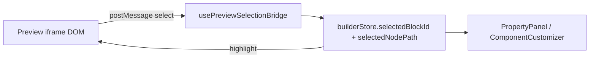

# Architecture Spine — Universal Preview Selection

## Design Paradigm

Editor preview is a read model of template blocks. Selection is an overlay port: identity lives on rendered elements only while `editable=true`. The store already holds `{blockId, nodePath}`; nodePath stays an opaque string.



## Invariants & Rules

### AD-1 — Editor-only identity [ADOPTED]

- **Binds:** render route, DynamicEmailTemplate, all email components, Figma renderer
- **Prevents:** shipping `data-node-path` / `data-block-id` in ZIP/export HTML
- **Rule:** Selection attributes exist only when `editable` is true. Export and non-editor renders omit them.

### AD-2 — One opaque path protocol [ADOPTED]

- **Binds:** iframe bridge, store, code panel, property panel, customizer
- **Prevents:** a second selection channel for built-in vs Figma blocks
- **Rule:** Figma AST uses dotted child indexes (`0.1.2`). Built-in descendants use `field:{registryFieldKey}`. The bridge treats both as `nodePath` strings.

### AD-3 — Closest annotated ancestor wins [ADOPTED]

- **Binds:** `EDITABLE_SCRIPT` click handler
- **Prevents:** clicks on nested images/text selecting only the outer block
- **Rule:** Capture-phase click uses `closest('[data-node-path]')` first, then `[data-block-id]`. Annotated leaves (img, heading, button, text container) must carry their own attributes.

### AD-4 — Visual leaves, not layout chrome [ADOPTED]

- **Binds:** built-in component annotation
- **Prevents:** every table/td/spacer chrome becoming a competing hit target that hides content
- **Rule:** Annotate images, headings, body/rich-text hosts, links/buttons, dividers, and icon glyphs. Nested JSON content maps to the parent registry field (`field:rows`, `field:stats`, `field:socialLinks`).

### AD-5 — Property routing [ADOPTED]

- **Binds:** PropertyPanel, FieldRenderer
- **Prevents:** selecting a descendant with no editor feedback
- **Rule:** `field:*` paths highlight and scroll the matching property field. Numeric AST paths keep opening the Figma customizer.

## Consistency Conventions

| Concern | Convention |
| --- | --- |
| Attr names | `data-block-id`, `data-node-path` (existing) |
| Field paths | `field:` + registry `FieldDefinition.key` |
| Context | `PreviewEditContext` wraps each built-in block in editable render |
| Hidden variants | Desktop/mobile swap images remain selectable on the visible variant; hidden variant uses existing hide CSS |

## Stack

| Name | Version |
| --- | --- |
| Next.js | 14.2 |
| React / React Email | 18.2 / existing |

## Structural Seed

```text
src/lib/preview/          # selection identity helpers (no React Email import)
src/builder/preview/      # PreviewEditContext (client/server-safe React)
src/components/email/     # annotate visual leaves
src/app/api/email/render/ # bridge CSS/JS only when editable
```

## Capability → Architecture Map

| Capability | Lives in | Governed by |
| --- | --- | --- |
| Identity helpers | `src/lib/preview/selectionIdentity.ts` | AD-2 |
| Built-in annotation | email components + context | AD-1, AD-4 |
| Figma leaf coverage | `FigmaReactEmailBlock` | AD-3 |
| Property highlight | PropertyPanel / FieldRenderer | AD-5 |
| Export isolation | render route `editable` flag | AD-1 |

## Deferred

- Keyboard spatial selection beyond click/hover
- Per-array-item property editors (JSON rows stay one field)
- Overlay drawing instead of CSS outline on table cells that ignore outline in some clients
