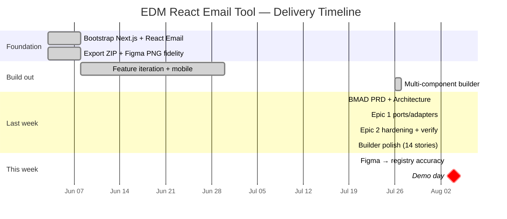
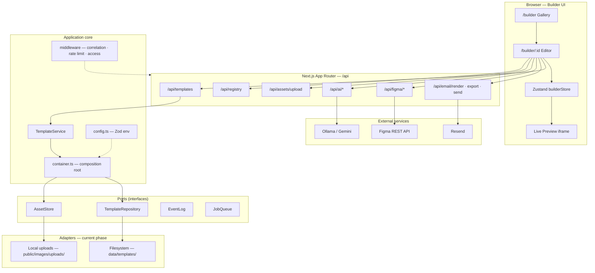
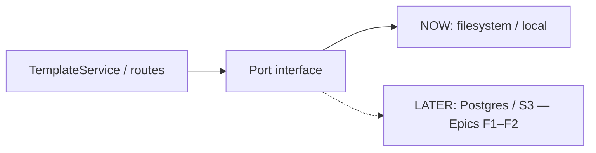
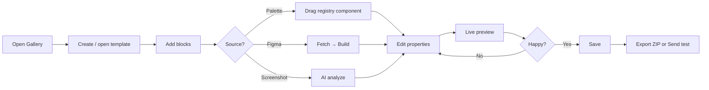
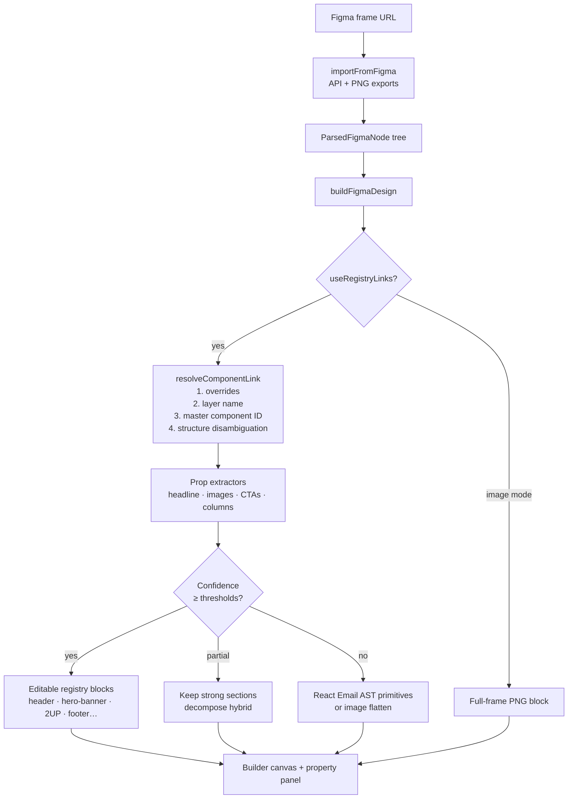
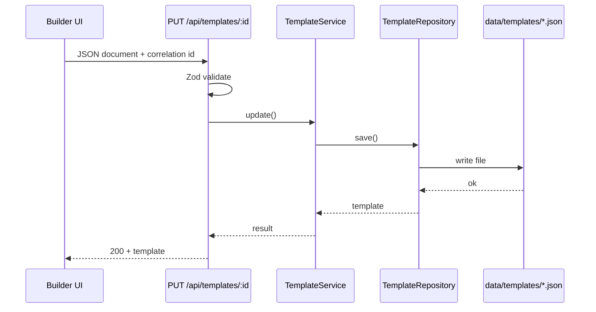
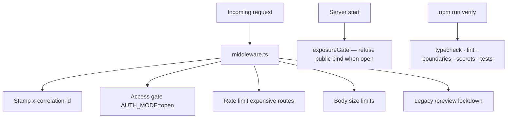
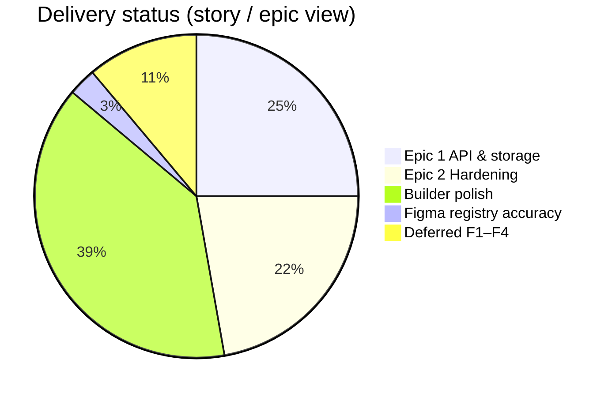

# Demo Presentation Pack — EDM React Email Tool

**Audience:** stakeholders / team demo  
**Demo date:** Tuesday, Aug 4, 2026  
**Branch:** `bmad-2` · **Verify:** `npm run verify` (26 tests)

> **Best visuals:** open [`demo-diagrams.html`](./demo-diagrams.html) in Chrome/Edge → press **F11** for fullscreen. Arrow keys / PageUp·Down move between slides. Print → Save as PDF for PowerPoint.
>
> Mermaid source for editing also lives below. Talking points: [`DEMO-PRESENTATION.md`](./DEMO-PRESENTATION.md) (this file).

---

## 0. Elevator pitch (15 seconds)

> We have a **prebuilt React Email component library** you drag onto a canvas. When Figma has a **new** component, paste **desktop + mobile** frame URLs, fetch design context, and **build with React Email** ([react.email/components](https://react.email/components)). Add the result to the canvas, **customize styles** in the tool, and — when email clients can’t handle the CSS — choose **image flatten** instead of a React rebuild. **Batch** lets you build many Figma links in one go.

---

## 1. What the product is

| Capability | Status |
|------------|--------|
| Gallery + drag-and-drop editor | ✅ |
| Component registry (Header, Hero, 2UP, Footer, …) | ✅ |
| Live HTML preview (React Email) | ✅ |
| Figma fetch / build / batch import | ✅ |
| Figma → **registry component links** (editable blocks) | ✅ |
| Screenshot / AI import (Ollama or Gemini) | ✅ |
| Export ZIP + Resend test send | ✅ |
| Architecture ports (ready for Postgres/S3/auth) | ✅ ports · ⏸ adapters deferred |
| Production authentication | ⏸ Deferred (Epic F4) |

---

## 2. Timeline (4-week narrative + full git arc)

First commit: **2026-06-03**. Intensive productization: **last ~4 weeks** (late July → Aug 3).

### Week-by-week (demo narrative)

### Day-by-day (last week + this week)

| Day | Date | What shipped |
|-----|------|----------------|
| Fri | Aug 1 | BMAD planning integration — PRD, architecture spine, epics |
| Sat | Aug 2 AM | **Epic 1** — config, ports, filesystem adapters, TemplateService, errors, logging, boundaries |
| Sat | Aug 2 PM | **Epic 2** — lint/test verify, access gate, rate limits, secrets, exposure gate |
| Sat | Aug 2 Eve | **Builder polish** — mobile, toasts, unsaved guard, import menu, a11y, gallery search, docs |
| Sun/Mon | Aug 3 | **Figma accuracy** — component links, master IDs, 2UP disambiguation, hybrid decompose |
| Tue | Aug 4 | **DEMO** |

### Earlier foundation (mention briefly)

| When | What |
|------|------|
| Jun 3 | First commit, source, image upload API, Figma AI path |
| Jun 4 | Figma PNG exports for pixel-accurate builds |
| Jun–Jul | Continuous UI/component iteration |
| Jul 26–27 | Multiple component feature; image & design feature |

---

## 3. Architecture diagram

### Ports & adapters (future-ready)

---

## 4. User workflow — day-to-day builder

---

## 5. Figma → React Email pipeline (accuracy story)

### Mapping modes (what to show on Import Result)

| Mode | Meaning | Demo message |
|------|---------|--------------|
| `registry` | Matched design-system sections | “Editable components — not just an image” |
| `primitives` | AST Section/Row/Text/Button | “Still editable structure; polish in customizer” |
| `image` | Flattened frame PNG | “Pixel-perfect when layout can’t map” |

---

## 6. Request path — save template

---

## 7. Security posture (Epic 2 — 30-second slide)

---

## 8. Progress scoreboard

| Phase | Stories | Status |
|-------|---------|--------|
| Epic 1 Consistent API & storage | 1.1–1.9 | ✅ Complete |
| Epic 2 Internal hardening | 2.1–2.8 | ✅ Complete |
| Builder polish | #1–#14 | ✅ Complete |
| Figma component-link accuracy | — | ✅ Shipped Aug 3 |
| F1 Postgres · F2 S3 · F3 Worker · F4 Auth | — | ⏸ Deferred |

---

## 9. Live demo script (8–10 minutes)

1. **Gallery** (`/builder`) — search, create template  
2. **Editor** — show 3-column layout; drag a block; edit props; show toast / auto-save  
3. **Import ▾** — Fetch Figma URL (have a known good Header/Hero/Footer frame ready)  
4. **Build** — point to `mappingMode: registry` / reasoning text  
5. **Edit** imported headline / CTA in property panel  
6. **Preview** desktop/mobile feel  
7. **Export** ZIP download  
8. **(Optional)** Send test if Resend configured  
9. **Close** with architecture: ports ready, cloud/auth not blocking today’s value  

### Backup if Figma token fails

- Use an already-imported template from gallery  
- Or Screenshot Upload with Ollama/Gemini  
- Or pure palette drag-and-drop path  

---

## 10. Likely Q&A

| Question | Answer |
|----------|--------|
| Is this production SaaS? | Internal tool; `AUTH_MODE=open`. Auth/Postgres/S3 designed as ports, not built yet. |
| How accurate is Figma import? | Best on Nissan DS names/IDs (Header, Hero, 2UP, call-out…). Unmatched → primitives/image. Accuracy improved Aug 3 with name-first links + ID table. |
| Why React Email? | Component model + email-safe HTML; maintainable vs sliced Handlebars-only. |
| What’s next? | Stakeholder choice: more Figma IDs, or F1–F4 infrastructure. |

---

## 11. Files to open during Q&A

| Topic | Path |
|-------|------|
| Architecture summary | `docs/ARCHITECTURE.md` |
| Builder how-to | `docs/BUILDER.md` |
| Component links | `src/lib/figma/componentLinks.ts` |
| Master IDs | `src/lib/figma/figmaComponentIds.ts` |
| Handoff / status | `_bmad-output/planning-artifacts/HANDOFF.md` |

---

*Generated for demo day · Update this file after major milestones.*
